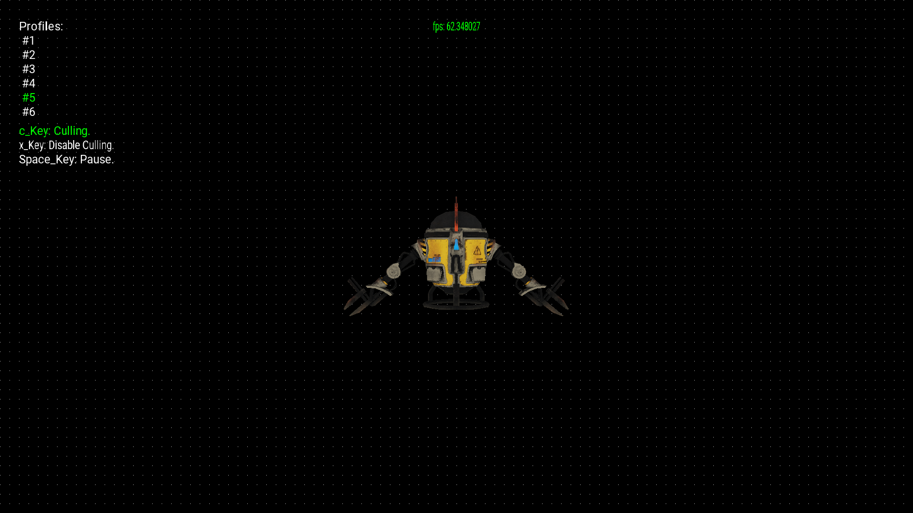
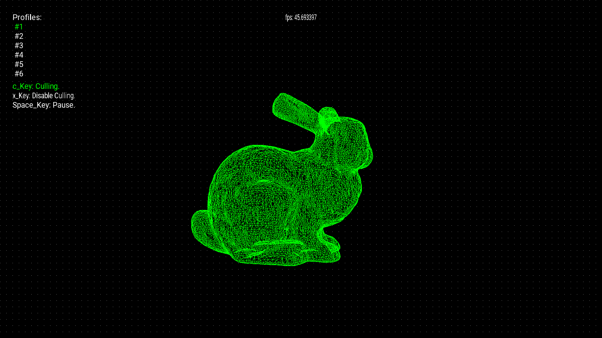
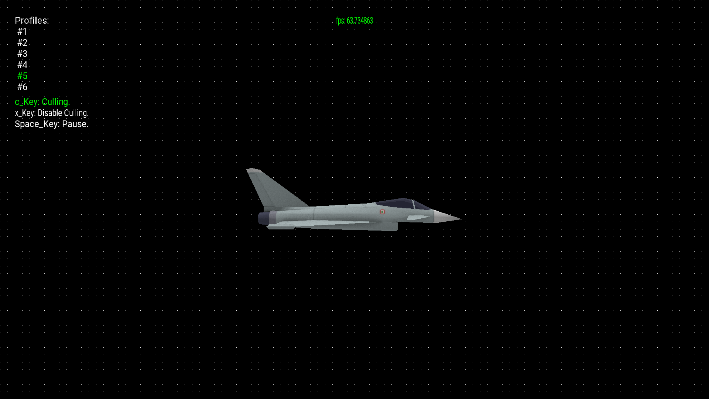

# 🧩 3D Software Renderer

A simple and lightweight **software renderer** written in **C++**, capable of loading and rendering 3D models in [Wavefront `.obj`](https://en.wikipedia.org/wiki/Wavefront_.obj_file) format — **without using GPU APIs** such as OpenGL or DirectX.

This project was built as a **learning exercise** in computer graphics, rasterization, and 3D mathematics — understanding how pixels, triangles, and transformations come together to form a rendered scene.

---

## 🖼️ Preview

<p align="center">
  
  
  
  
</p>

---

## 🚀 Features

- CPU-based 3D rendering pipeline (no GPU acceleration)
- Support for **.obj** mesh loading
- Basic Rasterization and Lighting
- Basic Texturing (if textures available with the same model name)
- Real-time display using **SDL2**
- Control camera position and camera yaw angle with **Arrow** Keys and camera pitch angle with **W/S** keys
- Optional integration with **Tracy** (profiling) and **Google Benchmark**

---

## 🧱 Dependencies

| Library | Purpose | Install via vcpkg |
|----------|----------|------------------|
| **SDL2** | Window creation & rendering | `vcpkg install sdl2` |
| **SDL2_image** | Texture loading | `vcpkg install sdl2-image` |
| **SDL2_ttf** | Font rendering | `vcpkg install sdl2-ttf` |
| **Tracy** *(optional)* | Performance profiling | `vcpkg install tracy` |
| **Google Benchmark** *(optional)* | Benchmarking | `vcpkg install benchmark` |

> 💡 The project uses **vcpkg** with **CMakePresets.json** for dependency management and build configuration.

---

## ⚙️ Building

1. Clone the repository:
   ```bash
   git clone https://github.com/khshmt/3dRenderer.git
   cd 3dRenderer
   cmake --preset=default
   cmake --build --preset=default
   ```
---

## 🚀 Running the Project

After building the project, you can run the executable directly from the build directory.

### ▶️ Run from the command line

```bash
./3dRenderer <path_to_obj_model>
```
---

## 🕹️ Controls

| Key | Action |
|-----|--------|
| `↑` / `↓` | Move camera **forward / backward** |
| `←` / `→` | Rotate camera **yaw** (turn left/right) |
| `W` / `S` | Adjust camera **pitch** (look up/down) |
| `C` | **Enable** keyframe culling |
| `X` | **Disable** keyframe culling |
| `Esc` | Exit the renderer |

> 💡 Use these controls to navigate the 3D scene and toggle rendering modes dynamically.

---

## 📚 Credits

This project was developed while following the [**3D Graphics Programming from Scratch**](https://pikuma.com/courses/learn-3d-computer-graphics-programming) course by [**Gustavo Pezzi**](https://pikuma.com/about), founder of [**Pikuma**](https://pikuma.com).  
Both the learning process and the included 3D assets are based on this course, and are used here purely for educational and non-commercial purposes.
